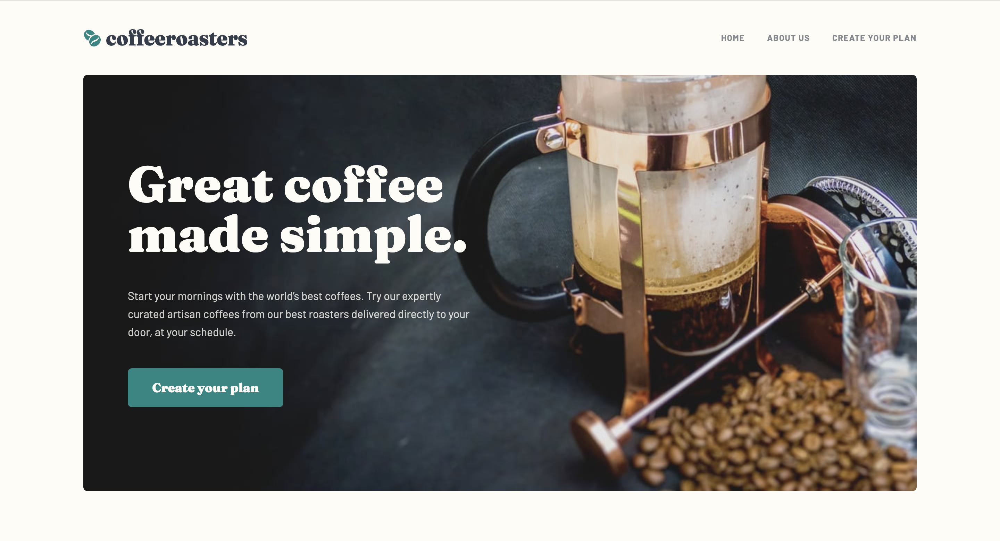

# Frontend Mentor - Coffeeroasters subscription site solution

This is a solution to the [Coffeeroasters subscription site challenge on Frontend Mentor](https://www.frontendmentor.io/challenges/coffeeroasters-subscription-site-5Fc26HVY6). Frontend Mentor challenges help you improve your coding skills by building realistic projects.

### The challenge

Users should be able to:

- View the optimal layout for each page depending on their device's screen size
- See hover states for all interactive elements throughout the site
- Make selections to create a coffee subscription and see an order summary modal of their choices

### Screenshot

### Links

- Solution URL: [Add solution URL here](https://your-solution-url.com)
- Live Site URL: [Add live site URL here](https://your-live-site-url.com)

### Built with

- [React](https://reactjs.org/) - JS library
- [Next.js](https://nextjs.org/) - React framework
- [NextUI](https://nextui.org/) - React UI library
- [Tailwind CSS](https://tailwindcss.com/) - CSS framework
